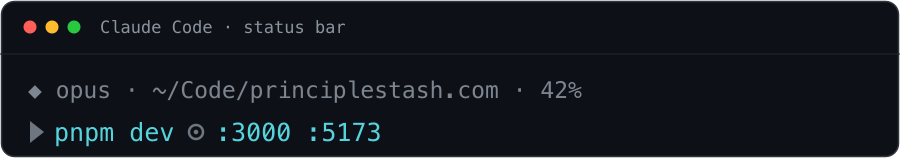
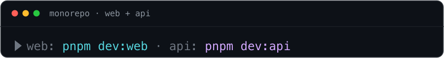
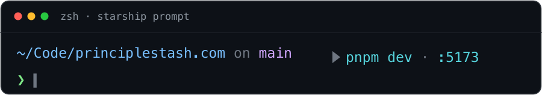

<p align="center">
  
</p>

<h1 align="center">runcommand</h1>

<p align="center">
  Your project's <strong>run command</strong> — and the localhost ports it's
  serving — in your status bar and shell prompt.<br/>
  LLM-detected once, cached, self-healing, and clickable.
</p>

**The problem:** you're juggling a dozen repos and every one starts differently —
`pnpm dev` here, `yarn dev` there, `cargo run`, `docker compose up`… You open a
project and have to dig through `package.json` (again) just to remember how to run
it. **runcommand** works it out and keeps it in front of you:

<p align="center">
  
</p>

A headless LLM call (Claude Code's `claude -p` by default — or [any agent you
configure](#detection-agent)) works the command out from your scripts, lockfile and
manifests, **caches it per project**, and only re-asks when a manifest changes — so the
render never waits on the model (cache hit ~50ms; a miss shows `▶ finding run command…`
and detects in the background). It's a tiny, **dependency-free** Node CLI that speaks
Claude Code's status-line contract, so the same answer drops into **starship**,
**OpenCode**, **Qwen Code** and more, [alongside](#coexisting-with-another-status-line)
whatever already draws your status line.

## Install

One command:

```sh
npm i -g @amabush/runcommand && runcommand init
```

`init` detects the tools you actually have — Claude Code, Qwen Code, starship, tmux — and
wires each one, backing up every file it touches and preserving any status line you already
run. `--dry-run` previews the lot without writing, `--yes` skips the prompts, and
`runcommand uninstall` puts everything back.

Needs **Node ≥ 18** (already there if you run Claude Code) and an **AI CLI on your
`PATH`** for detection — [`claude`](https://claude.com/claude-code) by default; OpenCode,
Gemini CLI, Qwen Code, Codex or [DeepSeek Harness](https://github.com/deepseek-ai/deepseek-harness)
work too. Developed on macOS/Linux; [Windows](#windows) is best-effort.

<details>
<summary>From a clone instead</summary>

```sh
git clone https://github.com/Amir-Abushanab/runcommand.git ~/.runcommand && node ~/.runcommand/bin/runcommand.mjs init
```

Run from a checkout, `init` offers to put `runcommand` on your `PATH` (a symlink into
`~/.local/bin`) and otherwise writes the absolute `node …/runcommand.mjs` invocation into
your configs — so keep the clone somewhere permanent. You can also skip `init` entirely
and wire things up by hand: every section below is the manual equivalent of what it
writes. (Don't install with `npx` — it runs from a cache directory that disappears, so
`init` refuses.)
</details>

## Claude Code

Add a `statusLine` to `~/.claude/settings.json`:

```json
{
  "statusLine": {
    "type": "command",
    "command": "runcommand statusline",
    "padding": 0
  }
}
```

If you didn't link it, use the full path instead:
`"node /ABSOLUTE/PATH/TO/runcommand/bin/runcommand.mjs statusline"`. That's it — the first
time you open each project the line reads `▶ finding run command…` for a few seconds, then
flips to the real command and stays cached.

### Coexisting with another status line

Claude Code has exactly one `statusLine` slot, so to show **both** lines one has to render
the other. Set `RUNCOMMAND_BASE` to any command that prints a status line and runcommand
renders that first, then its own line beneath:

```json
"command": "RUNCOMMAND_BASE='your existing status line command here' runcommand statusline"
```

The same stdin JSON is passed through, so anything that reads the standard contract just
works, and the other tool's config is never touched. (The reverse works too: if your other
tool can chain a child status line, point *it* at `runcommand statusline`.)

## Detection agent

Detection is just a headless LLM call: runcommand hands an AI CLI your project's signals —
`package.json` scripts, the package manager, the manifest list, a run hint from the README —
and reads the command back. It tries agents in the table's order and uses the **first
that's installed and answers** — so uninstalling Claude Code silently falls through to whatever
else is on the machine, and you never *need* a specific agent. `RUNCOMMAND_AGENT` pins one
(`opencode`) or sets the chain (`opencode,claude`). A broken agent falls through too; a
clean "no run command" answer does not.

| `RUNCOMMAND_AGENT` | Runs | Needs on `PATH` |
| --- | --- | --- |
| `claude` *(default)* | `claude -p "<prompt>" --model haiku` | [Claude Code](https://claude.com/claude-code) |
| `opencode` | `opencode run "<prompt>"` | [OpenCode](https://opencode.ai) |
| `gemini` | `gemini -p "<prompt>"` | [Gemini CLI](https://github.com/google-gemini/gemini-cli) |
| `qwen` | `qwen -p "<prompt>"` | [Qwen Code](https://github.com/QwenLM/qwen-code) |
| `codex` | `codex exec "<prompt>"` | [Codex CLI](https://github.com/openai/codex) |
| `deepseek` | `dsh --profile headless "<prompt>"` | [DeepSeek Harness](https://github.com/deepseek-ai/deepseek-harness) |
| `cursor` | `cursor-agent -p --output-format text "<prompt>"` | [Cursor CLI](https://cursor.com/docs/cli/headless) |
| `crush` | `crush run -q "<prompt>"` | [Charm Crush](https://github.com/charmbracelet/crush) |
| `amp` | `amp -x "<prompt>"` | [Amp](https://ampcode.com) |
| `llm` | `llm "<prompt>"` | [llm](https://llm.datasette.io) |
| `sgpt` | `sgpt "<prompt>"` | [Shell GPT](https://github.com/TheR1D/shell_gpt) |
| `aider`† | `aider --yes --no-auto-commits --message "<prompt>"` | [Aider](https://aider.chat) |
| `goose`† | `goose run --no-session -t "<prompt>"` | [goose](https://block.github.io/goose/) |
| `copilot`† | `copilot -p "<prompt>"` | [Copilot CLI](https://docs.github.com/en/copilot/how-tos/copilot-cli) |
| `ollama`\* | `ollama run <model> "<prompt>"` | [Ollama](https://ollama.com) — local |

<sub>† Agentic — `aider` edits files, `goose` runs tools, `copilot` is auth-gated — so they sit **last** in the default chain (reached only when nothing cleaner is installed, i.e. it genuinely is your agent), with side-effect-minimizing flags.<br/>
\* Never in the default chain, since `ollama run` pulls a multi-GB model on first use. Opt in with `RUNCOMMAND_AGENT=ollama RUNCOMMAND_MODEL=llama3.2`.</sub>

`RUNCOMMAND_MODEL` overrides the model (`haiku` for `claude`, the agent's own default
otherwise; `amp`, `goose` and `deepseek` take no per-call model flag, so it's ignored
there — DeepSeek Harness picks its model from the booted profile). **`runcommand agents`** shows the resolved chain; `--probe` actually calls each
one to confirm it responds (installed ≠ authenticated).

**Any other CLI?** Point `RUNCOMMAND_DETECT_CMD` at anything that takes a prompt and prints
the answer to stdout. The prompt is appended as the final argument, or substituted for a
`{}` placeholder, so quoting is never your problem:

```sh
RUNCOMMAND_DETECT_CMD="my-llm --fast"          # runs: my-llm --fast "<prompt>"
RUNCOMMAND_DETECT_CMD="my-llm --prompt {} -q"  # runs: my-llm --prompt "<prompt>" -q
```

It only has to emit the command in `<cmd></cmd>` tags (the prompt says how); caching, ports
and self-healing are unchanged. `RUNCOMMAND_AGENT_BIN` points at a binary that isn't on the
status line's `PATH`.

## Overrides (instant, no model call)

To pin a project's command yourself — for anything the model gets wrong, or to skip the
model entirely — add a **`.claude-run`** file (or `.runcommand`), one command per line:

```
make serve PORT=8080
```

…or a **`Run:`** line to the project's `CLAUDE.md` (only `CLAUDE.md`, and only outside code
fences, so documentation examples like this one don't count):

```
Run: docker compose up --build
```

Overrides win over the cache and cost nothing.

**Several services?** Prefix each with a `label:` and they render on one compact line, each
in its own color (cycled from a colorblind-safe palette; tune with `RUNCOMMAND_COLORS`):

```
web: pnpm dev:web
api: pnpm dev:api
```

<p align="center">
  
</p>

Detection finds these on its own too — the model returns each genuinely-distinct
long-running service, and won't split one app into build/lint/test. A single-service
project stays a single unlabeled entry (`▶ pnpm dev`).

## Live localhost ports

Alongside the run command, the line shows the project's **currently running** localhost
servers, as clickable links:

```
▶ pnpm dev   ◉ :3000 :5173
```

Ports come from `lsof` (`netstat -ano` on Windows) and are **scoped to the project** — only
listeners whose process runs inside the project directory show up, so postgres, docker and
other repos' servers don't leak in. Ephemeral ports (`≥ 49152`) and debuggers (`9229`) are
filtered, and the scan is cached for 2.5s so it stays cheap on the hot path.
`RUNCOMMAND_NO_PORTS=1` hides them entirely.

**Clickability, per surface.** Two styles: **`compact`** (`:3000`, a short OSC 8
hyperlink) is the default, and **`url`** (`http://localhost:3000` as visible text, which
terminals auto-link on their own) is for surfaces that strip OSC 8. Which is which isn't a
guess:

| Surface | OSC 8 | Style | How we know |
| --- | --- | --- | --- |
| Claude Code status line | passes through | `compact` | [documented](https://code.claude.com/docs/en/statusline#clickable-links) — OSC 8 links are a supported status-line feature |
| starship / Oh My Posh | passes through | `compact` | by construction: your terminal draws the prompt, so only its support matters |
| **tmux** status bar | **stripped** | **`url`** | measured — tmux stores the escape verbatim, then emits none of it to the client |
| Qwen Code | reported stripped | `url` | not independently verified; `init` sets `RUNCOMMAND_PORT_STYLE=url` for it anyway |
| Zellij (zjstatus) | unverified | `url` | assume tmux-like until someone measures it |
| OpenCode footer | n/a | n/a | the plugin reads `--json` and builds its own links via OpenTUI |

`RUNCOMMAND_PORT_STYLE` overrides the default on any surface.

## Other surfaces

Same tool, different places to put the line. Of the terminal AI tools only Claude Code and
Qwen Code expose a config-based status line; for everything else, use an ambient surface.

<p align="center">
  
</p>

**starship** — exactly what `runcommand init` writes:

```toml
[custom.runcommand]
command = "runcommand promptline"   # or: node /path/to/bin/runcommand.mjs promptline
when = true
format = "($output )"
shell = ["bash", "--noprofile", "--norc"]
ignore_timeout = true
```

`when = true` is not optional — starship skips a custom module that declares no run
condition, so without it the segment renders nothing and the command is never even
spawned. `promptline` is non-blocking and prints nothing outside a project, so it decides
for itself when to disappear; `ignore_timeout` keeps a cold port scan under starship's
500 ms cap. For a
right-aligned tagline add `right_format = "${custom.runcommand}"`. The trailing space
inside `($output )` is load-bearing — starship trims a module's output, so without it the
next segment renders as `:4321took 10s`.

**Qwen Code** — it copied Claude Code's `statusLine` contract, so it drops straight into
`~/.qwen/settings.json` (Qwen strips OSC 8, so `url` ports stay clickable):

```json
{ "ui": { "statusLine": {
  "type": "command",
  "command": "RUNCOMMAND_PORT_STYLE=url runcommand statusline"
} } }
```

**Oh My Posh** — a `command` segment in a block of your theme (`properties` is being
renamed to `options` upstream):

```json
{ "type": "command", "style": "plain", "template": " {{ .Output }} ",
  "properties": { "shell": "bash", "command": "runcommand promptline" } }
```

**OpenCode** — no status-line command, but it loads TUI plugins: a ready-made one in
[`integrations/opencode/`](integrations/opencode/) renders the command + ports into the
footer. See its README to install.

**Codex** — no command-backed status line yet
([openai/codex#17827](https://github.com/openai/codex/issues/17827)). Its contract is Claude
Code's, so when it ships it'll be a one-block write to `~/.codex/config.toml`.

### Ambient surfaces

Some tools — **aider**, **goose**, **Cursor**, **Codex**, GitHub **Copilot** — are
full-screen TUIs with no status-line hook, so runcommand can't render *inside* them. It
doesn't need to: an ambient surface shows the line *around* whatever's running (and so does
the shell prompt above, before you launch the tool).

**tmux** — the command stays visible the whole time you're inside aider/goose/etc., and
tracks the active pane's project. `runcommand init` wires this for you, appending with
`set -ga` so your existing `status-right` is kept, not clobbered:

```tmux
set -ga status-right " #(runcommand prompt -C '#{pane_current_path}')"
```

`runcommand prompt` prints the plain command, and nothing in non-project dirs. Append live
ports with `#(runcommand ports --urls -C '#{pane_current_path}')` — `--urls` matters here,
because tmux strips OSC 8 hyperlinks out of the status line, so the compact `:3000` form
would render as dead text.

**Terminal title** — a universal fallback, from a zsh `precmd()` or bash `PROMPT_COMMAND`
(some TUIs overwrite it):

```sh
printf '\033]0;%s\007' "$(runcommand prompt)"
```

<details>
<summary><b>Zellij</b> — needs the <code>zjstatus</code> plugin</summary>

Zellij's built-in status bar can't run commands, so this needs
[`zjstatus`](https://github.com/dj95/zjstatus) (download `zjstatus.wasm` into
`~/.config/zellij/plugins/`). In your layout:

```kdl
pane size=1 borderless=true {
    plugin location="file:~/.config/zellij/plugins/zjstatus.wasm" {
        format_left                 "{command_runcommand}"
        command_runcommand_command  "bash -lc 'runcommand prompt'"
        command_runcommand_format   "{stdout}"
        command_runcommand_interval "5"
    }
}
```

`runcommand init` detects zellij and prints these steps (it won't download the plugin for
you). Note zjstatus runs the command from the session's directory, not per-pane.
</details>

## Commands

```sh
runcommand statusline        # render run command + live ports (Claude Code calls this)
runcommand prompt [dir]      # plain run command for a shell prompt (non-blocking)
runcommand promptline [dir]  # run command + clickable ports, styled (for starship)
runcommand ports [dir]       # this project's live localhost ports (--links --json --all)
runcommand detect [dir]      # detect now (asks the configured agent), print + cache
runcommand get [dir]         # print the cached command (detect if missing)
runcommand refresh [dir]     # re-detect and overwrite the cache
runcommand path [dir]        # print the cache file path
runcommand init              # wire runcommand into your installed tools (--yes --dry-run --surfaces)
runcommand uninstall         # remove that wiring (restores what was there; --dry-run)
runcommand agents            # show the detection chain — which agents are installed (--probe to test each)
```

`dir` defaults to the current directory; the project root is the nearest `package.json` /
manifest / `.git`, walking up.

**Wrong guess?** Tell it what's wrong with `--hint`:

```sh
runcommand refresh --hint "it's picking the API; I want the web dev server"
# -> pnpm run dev:web
```

The note is **saved with the project** and reused on every later re-detect, so a future
manifest change won't regress to the wrong answer. Wipe it with `--clear-hint`; for a hard,
exact pin use an [override](#overrides-instant-no-model-call).

## Config (env vars)

| Var | Default | Purpose |
| --- | --- | --- |
| `RUNCOMMAND_AGENT` | *(auto)* | Detection agent priority list, first installed wins — e.g. `opencode,claude` |
| `RUNCOMMAND_DETECT_CMD` | – | Full custom detect command; the prompt is appended, or put where `{}` appears |
| `RUNCOMMAND_AGENT_BIN` | – | Path to the agent binary (else auto-resolved) |
| `RUNCOMMAND_MODEL` | `haiku`\* | Detection model (\*`haiku` for `claude`; the agent's own default otherwise) |
| `RUNCOMMAND_BASE` | – | Another status-line command to render above ours |
| `RUNCOMMAND_ICON` | `▶` | Leading glyph (set empty to drop it) |
| `RUNCOMMAND_LABEL` | – | Text before the command, e.g. `run: ` |
| `RUNCOMMAND_COLORS` | `36,33,35,34,32` | Per-service colors (ANSI codes), cycled by position; one code = one color |
| `RUNCOMMAND_TTL_MS` | `0` (off) | Re-detect after this long even if the manifest is unchanged |
| `RUNCOMMAND_PORT_STYLE` | `compact` | `compact` = `:PORT` as an OSC 8 link; `url` = full visible `http://localhost:PORT`, for surfaces that strip OSC 8 |
| `RUNCOMMAND_NO_PORTS` | – | Hide live ports in the status line |
| `RUNCOMMAND_PORTS_TTL_MS` | `2500` | How long a port scan is cached (ms) |
| `RUNCOMMAND_IGNORE_PORTS` | `9229,9230` | Ports to never show (e.g. debuggers) |
| `RUNCOMMAND_CLAUDE` | – | Path to the `claude` binary (alias for `RUNCOMMAND_AGENT_BIN` when the agent is `claude`) |
| `NO_COLOR` | – | Disable ANSI color |

## The cache

`$XDG_CACHE_HOME/runcommand/` (falls back to `~/.cache/runcommand/`, or
`%LOCALAPPDATA%\runcommand` on Windows), one JSON file per project.

There's **no time-based expiry** — a detected command is cached indefinitely and
invalidated by **content, not time**. Every render hashes the project's signals
(`package.json` scripts and `packageManager`, the lockfile and manifest list, the
*contents* of command-defining manifests like `Makefile`, `Justfile`, `docker-compose*`,
`Cargo.toml`, `pyproject.toml`, and any override) and re-detects in the background the
moment they change — so when an agent, or you, edits one, the command updates itself.
`RUNCOMMAND_TTL_MS` adds a fixed-age re-detect on top.

Cache files carry a version, and a build that doesn't recognise it treats the file as a
plain miss. The config blocks `init` writes are versioned too, so **re-run `runcommand
init` after upgrading**: it offers an in-place refresh of any stale block, and never
touches a config you wired by hand. Full rules in [CONTRIBUTING.md](CONTRIBUTING.md).

## Windows

Windows is wired up but **has not been run on a real Windows machine** — treat it as
best-effort and please open an issue with what breaks. Rendering is the easy half: Windows
Terminal handles ANSI styling and OSC 8, so the line and its clickable ports look the same
as anywhere else.

The one real compromise is port scoping: Windows exposes no process working directory to a
plain CLI, so runcommand matches the project path against each listener's **command line**
instead. That covers the common case (a dev server launched from the project carries the
path in its argv) and is deliberately biased toward showing *nothing* rather than another
project's port — `runcommand ports --all` ignores scoping entirely.

<details>
<summary>What else differs underneath</summary>

| | macOS / Linux | Windows |
|---|---|---|
| Listener scan | `lsof -nP -iTCP -sTCP:LISTEN` | `netstat -ano -p TCP` |
| Scoped to project by | process **cwd** (`lsof -a -d cwd`) | process **command line** (`Get-CimInstance Win32_Process`) |
| Agent lookup | exact filename on `PATH` | `PATHEXT` probing, so `claude` finds `claude.cmd` |
| starship `shell` | pinned to `bash --noprofile --norc` | omitted; starship's `cmd /C` default |
| PATH install | symlink into `~/.local/bin` | `npm i -g <repo>` (symlinks need Developer Mode) |
| Cache dir | `~/.cache/runcommand` | `%LOCALAPPDATA%\runcommand` |

`init` won't offer tmux on Windows (no `tmux` binary, no `~/.tmux.conf`); Claude Code and
starship wiring are unchanged, since both keep their config under `~/`.
</details>

## Development

`pnpm test` runs the suite — on Linux, macOS **and** Windows in CI, which is the only place
the Windows code actually executes. The [`site/`](site/) directory is an Astro showcase
(`pnpm site`). Release process and the versioning rules for generated config blocks are in
[CONTRIBUTING.md](CONTRIBUTING.md).

## License

MIT
